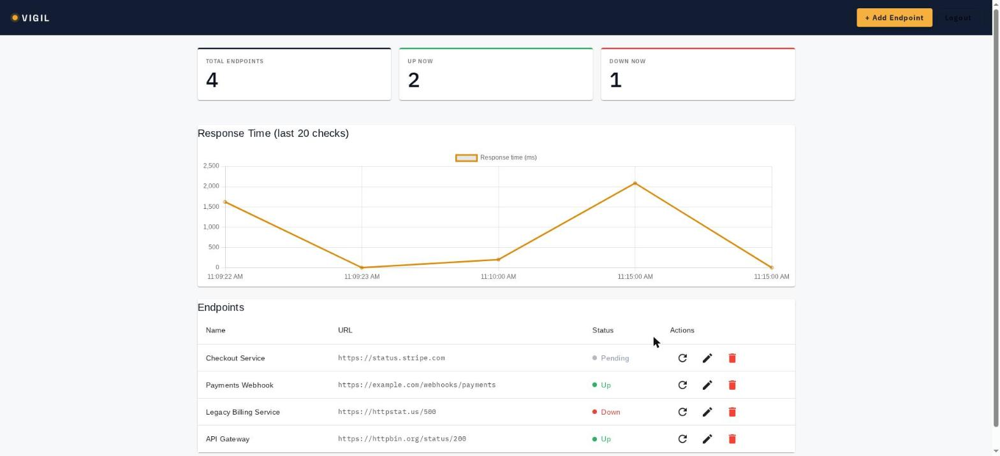
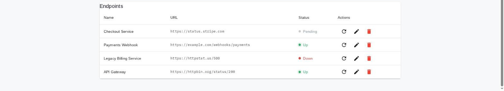
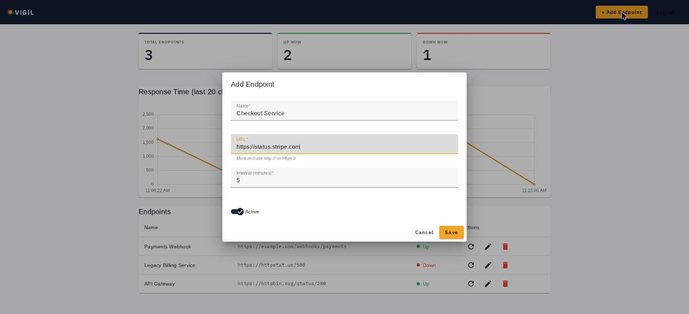

# Vigil – Uptime Monitor

[](https://www.djangoproject.com/)
[](https://www.django-rest-framework.org/)
[](https://docs.celeryq.dev/)
[](https://angular.dev/)
[](LICENSE)

---

## Summary

Vigil is a portfolio project that demonstrates a production-grade uptime monitoring system built
end-to-end: a Django REST API, a Celery-powered background task queue, and an Angular 21 dashboard.

Users register, add HTTP endpoints, and the system checks them every 5 minutes. On the first failed
check it opens an incident and sends an email alert. When the endpoint recovers, it closes the
incident and sends a resolution email. Failed alert emails are automatically retried with
exponential backoff via a dead-letter queue.

The goal is to show how the layers fit together — API design, async tasks, stateful incident
tracking, email reliability, and a reactive frontend — rather than to cover maximum surface area.

---

## Screenshots

### Dashboard



### Endpoint list



### Add endpoint



---

## Why this project

Most portfolio projects demonstrate CRUD. Vigil demonstrates the patterns that appear in
production systems:

- **Async task queues** — work is offloaded to Celery workers; the API never blocks on outbound HTTP.
- **Idempotency** — the check task guards against double-execution if Beat fires while a previous check is still running.
- **Incident lifecycle** — the system tracks state transitions (up → down → up), not just individual check results.
- **Email reliability** — failed sends are persisted to a dead-letter table and retried with exponential backoff rather than dropped silently.
- **SSRF defence** — two validation layers prevent users from pointing the monitor at internal infrastructure.
- **Security basics** — token expiry, global rate limiting, CORS restriction in production.

---

## Technical highlights

### Django REST API

- DRF with `ModelViewSet` for endpoints, check results, and incidents
- Custom `ExpiringTokenAuthentication` — tokens expire after 24 hours (configurable via `AUTH_TOKEN_EXPIRY_HOURS`)
- Global rate limiting: `AnonRateThrottle` (100 req/h) and `UserRateThrottle` (2 000 req/h), backed by Redis cache in production
- SSRF validation at serializer level: rejects private IP ranges, loopback, link-local (including `169.254.169.254`), and blocked hostnames before the record is saved
- Auto-generated OpenAPI schema via `drf-spectacular`; interactive Swagger UI at `/api/docs/`
- Custom `@action` endpoints: `POST /endpoints/{id}/check_now/` and `POST /incidents/{id}/resend_alert/`

### Angular 21 frontend

- Standalone components throughout; `inject()`-based DI, no NgModules
- Signal-based dashboard state (`signal`, `computed`) with a single derived `rows` signal that pre-computes status per endpoint — no repeated method calls in the template
- Angular Material table, summary cards, Chart.js response-time line chart
- `AuthGuard` (redirects unauthenticated users to `/login`) and `GuestGuard` (redirects logged-in users away from `/login` and `/register`)
- `MatSnackBar` for non-blocking error feedback; backend validation errors surfaced to the user
- Endpoints without a first check result show **Pending** rather than a misleading Down status

### Celery background checks

- `schedule_checks` task (every 5 minutes, via Beat) fans out one `check_endpoint.delay(id)` per active endpoint
- `check_endpoint` is **idempotent**: skips re-checking if the elapsed time since last check is less than the configured interval
- HTTP checks use `safe_get_request()`, which re-validates DNS on every request and follows redirects only after re-checking each hop — defending against DNS rebinding attacks
- Status < 500 counts as "up" (4xx responses are treated as the endpoint being reachable)

### Incident creation and tracking

- `Incident` is created on the first DOWN result after a period of UP results
- `Incident` is closed (and `ended_at` stamped) on the first UP result after a DOWN
- `duration_seconds()` computed from `started_at` / `ended_at`
- Alert emails reference the incident and include the duration on resolution

### Dead-letter email retry (DLQ)

- `send_alert_email` writes a `FailedEmail` record on any send failure
- `retry_failed_emails()` Celery task runs every 2 minutes, queries pending records, and re-attempts delivery
- Exponential backoff: first retry at 5 minutes, doubling each attempt, capped at 720 minutes (12 hours)
- Configurable via `FAILED_EMAIL_MAX_RETRIES` (default 8) and `FAILED_EMAIL_BASE_DELAY_MINUTES` (default 5)
- Each `FailedEmail` has a `status` property (`pending` / `sent` / `exhausted`) visible in the Django admin

### SSRF protection

Two independent validation layers:

1. **Serializer-level** (`validate_url_for_ssrf`) — runs at save time; catches obviously bad URLs before they reach the database
2. **Task-level** (`safe_get_request`) — runs on every HTTP request; re-resolves DNS to catch DNS rebinding, manually follows each redirect and re-validates the next hop

Blocked ranges include RFC 1918 private addresses, loopback (`127.0.0.0/8`), link-local (`169.254.0.0/16`), CGNAT (`100.64.0.0/10`), and their IPv6 equivalents.

### Test coverage

| Suite | Runner | Tests |
|---|---|---|
| Backend (tasks, DLQ, SSRF, views, auth) | Django test runner | 143 |
| Frontend (services, guards, dashboard) | Vitest + Angular TestBed | 29 |

---

## Local setup

### Prerequisites

- Python 3.12+
- Node.js 20+
- Redis — either installed locally or via Docker:
  ```bash
  docker run -d -p 6379:6379 redis:7
  ```

### Backend

```bash
cd backend
python -m venv venv
source venv/bin/activate          # Windows: venv\Scripts\activate
pip install -r requirements/dev.txt
python manage.py migrate
python manage.py createsuperuser  # optional — needed for /admin_portal/
python manage.py runserver        # API at http://localhost:8000
```

In separate terminals, start the Celery worker and scheduler:

```bash
celery -A config worker -l info
celery -A config beat -l info
```

### Frontend

```bash
cd frontend
npm install
ng serve                           # dev server at http://localhost:4200
```

The dev proxy (`proxy.conf.json`) rewrites `/api/*` to `http://localhost:8000`, so no CORS
configuration is needed during local development.

### Running tests

```bash
# Backend
cd backend && source venv/bin/activate
python manage.py test apps

# Frontend
cd frontend
ng test --watch=false
```

---

## 3-minute demo flow

1. Open `http://localhost:4200` — the route guard redirects to `/login`.
2. Click **Register** and create an account. You are logged in automatically.
3. The dashboard shows an empty state. Click **Add your first endpoint**.
4. Enter a name and a public URL (e.g. `https://httpstat.us/200`). Save.
5. The endpoint appears with status **Pending** — no check has run yet.
6. Click the **refresh** icon (Trigger check) to queue an immediate check via `POST /api/v1/endpoints/{id}/check_now/`.
7. Refresh the page. Status updates to **Up** (green icon + text) or **Down** (red icon + text).
8. Visit `http://localhost:8000/api/docs/` to explore the full API in Swagger UI.
9. If you ran `createsuperuser`, visit `http://localhost:8000/admin_portal/` to inspect incidents, check results, and the `FailedEmail` dead-letter queue.

---

## Docker Compose

The included `docker-compose.yml` runs the full stack locally with a single command:

```bash
cp .env.example .env
docker compose up --build
```

The example file contains working demo values — no editing required to run locally.

Services:

| Service | Role |
|---|---|
| `db` | PostgreSQL 15 |
| `redis` | Celery broker |
| `backend` | Gunicorn + Django |
| `worker` | Celery worker |
| `beat` | Celery Beat scheduler |
| `frontend` | nginx — serves Angular build, proxies `/api` to Django |

The app is available at `http://localhost:80`.

`docker-compose.yml` uses `config.settings.docker`: PostgreSQL, console email (emails appear in
`docker logs vigil-backend-1`), and `DEBUG=True`. No SMTP credentials are needed.

A separate `docker-compose.prod.yml` uses `config.settings.prod`: real SMTP, Redis cache backend,
tighter throttle limits, and `CompressedManifestStaticFilesStorage`. Fill in the email and
`CORS_ALLOWED_ORIGINS` fields in `.env` before using it.

---

## Project structure

```
backend/
├── apps/
│   ├── accounts/       # custom User model, registration, ExpiringTokenAuthentication
│   └── monitors/       # Endpoint, CheckResult, Incident, FailedEmail models + Celery tasks
├── config/             # Django settings split: base / dev / docker / prod
├── requirements/       # base.txt (runtime), dev.txt, prod.txt
└── manage.py

frontend/
├── src/app/
│   ├── core/           # AuthService, EndpointService, CheckService, interceptor, guards
│   └── features/       # dashboard, auth (login, register)
└── proxy.conf.json     # rewrites /api/* → localhost:8000 in development
```

---

## Roadmap

Features intentionally left out of scope for this portfolio project:

- [ ] Incident history page in the Angular dashboard
- [ ] Per-user alert cooldown and check interval configuration via the UI (backend already supports the data model)
- [ ] Webhook notifications (Slack, Teams, Discord)
- [ ] Email digest (daily / weekly summary instead of per-incident alerts)
- [ ] Multi-region probe distribution

---

## License

MIT © [Clifford](https://github.com/Cliffy1337)
